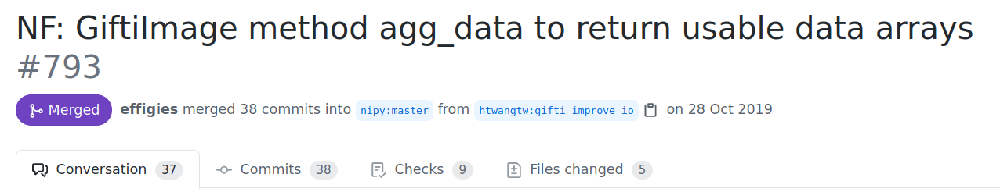

layout: false

class: center, middle, inverse

# Becoming a contributor
Current state of Open Source in Biology and Neuroscience
### Hao-Ting Wang

[wanghaoting.com/scipy2021-talk](https://wanghaoting.com/scipy2021-talk)

---

## Background

--

- PhD in cognitive neuroscience

- Postdoc Fellow at Brighton and Sussex Medical School

--

- Research topic: fMRI, functional connectivity, and multivariate analysis

--

- Contribute to Nilearn, Nibabel, Pydra

--

- Brainhack patron

---

.left-column[

## Background

## User / Consumer of software

]

--

.right-column[

### "Open science"

- Sharing code for research paper
- Preprint research paper
- Share summary data of neuroimaging studies

### Chanllenges in my research

- Multivariate methods requires decent sample-to-feature ratio
- Need better behavioural/brain measures to improve signal to noise ratio

]

---

.left-column[

## Background

## User / Consumer of software

## First PR

]

--

.right-column[

### Encountering things I want to improve

- Simplify data reading of a specific file format for surface image.

- Some cutting edge methods used data mapped onto cortical surface.

- Most tools are developed for volumetric data.

- The existing neuroimaging file library didn't support an easy method.

]

---

.left-column[

## Background

## User / Consumer of software

## First PR

]

.right-column[

### Encountering things I want to improve

### Met kind dev that is willing to help

I went to a summar school, met a dev, and got help for my first PR.

]

---

.left-column[

## Background

## User / Consumer of software

## First PR

]

.right-column[

### Encountering things I want to improve

### Met kind dev that is willing to help

### What did I learn?

- People are nice.
- There's a lot of bots/metrics to help with code quality.
- Style guilde.
- The real way of using git.

]

---

.left-column[

## Background

## User / Consumer of software

## First PR

]

.right-column[

### Encountering things I want to improve

### Met kind dev that is willing to help

### What did I learn?

### What did I do next?

- I spent one year sending PR to my own project and learn about software writing practice.

]

---

.left-column[

## Background

## User / Consumer of software

## First PR

]

.right-column[

### Encountering things I want to improve

### Met kind dev that is willing to help

### What did I learn?

### What did I do next?

- I spent one year sending PR to my own project and learn about software writing practice.

- Practice
]

---

.left-column[

## Background

## User / Consumer of software

## First PR

## Where am I now?

]

--

.right-column[
### I approach devs as a user if I have a question.
]

--

.right-column[
- Although most of the problems are between the table and the chair, people are still really helpful.
- Join forums and code sprint days to meet people.
]

--

.right-column[
### I intentionally includes open source work as part of my job.
]

--

.right-column[
### I contribute to more projects!
]

--

.right-column[
### I have like-minded friends now!
]

---

.left-column[

## Background

## User / Consumer of software

## First PR

## Where am I now?

## What's next?

]

--

.right-column[
- Survive as an academic.
]
--
.right-column[- Convince lonely PhD students to take part in open source work to make friends.]
